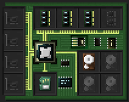
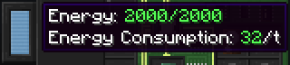

# Getting Started
This article describes the steps required to get a [computer](block/computer.md) up and running, and gives an example of how it can be used to interact with devices. We will focus on the [RISC-V processor](item/cpu_riscv.md) here, but building a [Z80](item/cpu_z80.md) computer works the same way, with a different set of parts. It makes for a cheaper start, but lacks many of the RISC-V architecture's capabilities.

## Building
First things first, you need an actual computer case, plus a couple of components. If you haven't already, craft these first:
- 1x [computer](block/computer.md)
- 1x [RISC-V processor](item/cpu_riscv.md)
- 1x **Linux firmware** [flash memory](item/flash_memory.md)
- 1x **Linux root file system** [hard drive](item/hard_drive.md)
- 3x 4M [Memory](item/memory.md)

Once you got all this, place down the computer. Open its inventory screen using a wrench. Alternatively, open the terminal screen, then use the toggle button to the left to switch to the inventory screen. Here, place the processor, the crafted hard drive and firmware and the memory into the computer. A computer without a processor will not start.

## Starting
To power up your freshly build computer, you'll usually need to supply it with some power. Have a look at the energy bar to the left of the terminal or inventory screen. Its tooltip informs you of the current amount of energy stored in the computer, and the amount of energy it requires per tick to keep running.

When you've ensured the required amount of energy is available, switch to the terminal screen and hit the power button to the top left. Alternatively use the computer while sneaking. The computer should now boot!

What you see next depends on the processor you installed. Carry on there: [RISC-V](item/cpu_riscv.md) or [Z80](item/cpu_z80.md).

Good luck, and most importantly, have fun!
