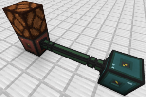
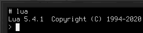
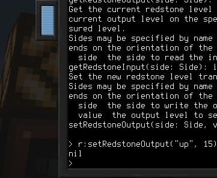

# High-level API
Controlling devices using Lua is a core concept when using [computers](block/computer.md). Many devices are so-called high-level API (HLAPI) devices. This means they are not controlled using regular Linux drivers, but via a simple RPC system, employing JSON messages over a serial device.

Everything in this entry needs the Linux system that ships for the [RISC-V processor](item/cpu_riscv.md). To reach devices from a [Z80 processor](item/cpu_z80.md), see the [mid-level API](mlapi.md) (MLAPI) entry.

## The Devices Library
The default Linux distribution includes libraries to make HLAPI devices more easily accessible. The `devices` library provides utilities for discovering devices and calling methods on them, as well as obtaining documentation on devices, when available.

Note: this document will use Lua to provide an overview, examples and API documentation. An equivalent library with API parity is also available for micropython. 

To use the `devices` library, import it using `require("devices")`. What you get back is an object, so its methods are called with colon notation: store it in a variable, then call `d:list()` rather than `d.list()`.

### Methods
`list():table` returns a list of all currently available devices. Each entry in the returned table represents a single device, including its type names and unique identifier.
- Returns the list of connected HLAPI devices.

`get(id:string):Device` returns a wrapper for a device with the specified identifier. This is similar to `find` but takes a specific identifier instead of a type name.
- `id` is the unique identifier of the device.
- Returns a wrapper for the specified device, or nothing if no device has that identifier.

`find(typeName:string):Device` returns a wrapper for a device of the specified type. If there are many devices of this type, it is undefined which one will be returned. Aliases set in [Bus Interfaces](block/bus_interface.md) may also be used.
- `typeName` is the device type for which to find a device.
- Returns a wrapper for a device of that type, or nothing if no device of that type is connected.

`methods(id:string):table` returns the list of methods offered by the device with the specified identifier. To obtain the list of methods in a more readable way, get the device wrapper and convert it to a string, instead. Also see the section on the device wrapper type.
- `id` is the unique identifier of the device.
- Returns the list of methods offered by the device.
- Throws an error if obtaining the method list failed.

`invoke(id:string, methodName:string, ...):any` calls the method with the specified name on the device with the specified identifier. Passes along any extra parameters. Using this method directly is not recommended. Prefer obtaining a device wrapper and invoking the method through it. Also see the section on the device wrapper type.
- `id` is the unique identifier of the device.
- `methodName` is the name of the method to invoke.
- `...` are parameters to pass to the method.
- Returns the result of the method.
- Throws an error if invocation failed, or the method threw an exception.

`waitEvent(timeout:number, eventType:string):table` waits for the next event sent by a device, such as a [robot](robotics.md) finishing an action.
- `timeout` is how long to wait for, in milliseconds. Pass `nil` to wait for as long as it takes.
- `eventType` is an optional event name. When specified, events of any other type are discarded while waiting.
- Returns the event, a table with a `type` and a `data` entry, or nothing if the timeout ran out first.

`blob(data:string):Blob` wraps binary data so that it may be passed to a device method. Parameters are otherwise sent as text, which would corrupt anything that is not.
- `data` is the bytes to wrap.
- Returns a value to pass as a parameter, as in `device:writeExportFile(d:blob(bytes))`.

## The Device Wrapper
Devices returned from the `devices` library are objects of type `Device`. This is a wrapper storing the device identifier.

Its main purpose is to enable seamless invocation of methods exposed by this device, as well as a convenient way to access documentation, if available.

To invoke a method on such a wrapper, use colon notation, and the method's name. For example:  
`wrapper:someMethod(1, 2, 3)`

To obtain the documentation of the device, `tostring` it. In the Lua interpreter, use `=wrapper`.

## Running Several Scripts at Once
The serial devices used for the RPC system can only be opened by one program at a time. A small background service, `oc2busd`, opens them once when the computer boots and passes messages along on behalf of everything else. While it's running, as many scripts as you like can use the `devices` library at the same time.

Calls are still carried out one at a time, in the order they arrive, so two scripts controlling the same device will not interleave halfway through an operation.

Events, such as a [robot](robotics.md) finishing an action, are delivered to *every* script that is listening, rather than to whichever one happened to ask first. A script that starts in the middle of an action may therefore see events for something it did not begin, which is why it is worth checking that an event refers to the action you are waiting on. `waitEvent` takes an event name to allow some early filtering.

Each `require("devices")` gives a script one connection to the service. To hold more than one at the same time, for example to keep a long-running call from holding up everything else, open further ones explicitly:  
`bus = require("oc2.bus").connect()`

Close such a connection with `bus:close()` once it is no longer needed. The one behind `require("devices")` is best left alone, since everything else in the script shares it.

If the service is not running for any reason, the `devices` library falls back to opening the serial devices directly. Everything keeps working, but only one program at a time can use it. The service writes to the system log, so `cat /var/log/messages` will say why it stopped.

## Example
For this example we will control a [redstone interface block](block/redstone_interface.md). First, place the block and connect it to the computer using [bus cables](block/bus_cable.md) and [bus interfaces](block/bus_interface.md).

We place a redstone lamp on top of the redstone interface to have a visual indicator that our commands work.

To verify the connection between device and computer, run the command `lsdev.lua` from the command line. This lists the identifiers and type names of all connected HLAPI devices. One of these should have the type `redstone` among its type names.

Start Lua in interactive mode by running just `lua` from the command line.

Include the devices library and store it in a variable named `d`:  
`d = require("devices")`

Then get the `Device` wrapper for the redstone interface block and store it in a variable named `r`:  
`r = d:find("redstone")`

The `redstone` in this call is the device type name, the same we checked for just earlier using `lsdev.lua`.

We now have a wrapper for the redstone interface block on which we may call methods. To get a list of the available methods, run `=r`.

For our example, we're interested in the `setRedstoneOutput` method. It allows setting the signal emitted from the redstone interface.

To light up our lamp, we want to emit a redstone signal from the top face of the redstone interface block:  
`r:setRedstoneOutput("up", 15)`

The lamp should now light up!

With this, you have the tools to learn the names of connected devices, which methods they offer and how to obtain their documentation. Go ahead and experiment with the other methods of the redstone interface to read incoming redstone signals, or try out other devices!
