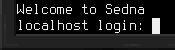

# RISC-V Processor

The processor is what a [computer](../block/computer.md) or [robot](robot.md) actually computes with. Without one in its processor slot, a machine will not start.

This is the 64-bit RISC-V processor. It runs the Linux system the computer ships with, and every card, module and drive documented in this manual is built for it.

Also see the [Z80 processor](cpu_z80.md).

## Starting Up
Build the machine as described in [getting started](../getting_started.md), using these parts:
- 1x [computer](../block/computer.md)
- 1x RISC-V processor
- 1x **Linux firmware** [flash memory](flash_memory.md)
- 1x **Linux root file system** [hard drive](hard_drive.md)
- 3x 4M [memory](memory.md)

Power it, turn it on and wait until you're prompted for a login.

Enter `root` as the user name to log in with and press enter. Well done, you now have a computer that's ready for use!

You can now add more devices, depending on what you want to use your computer for. For information on how to control devices, have a look at the [HLAPI](../hlapi.md) manual entry.
