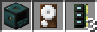
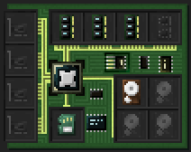
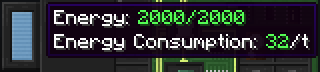
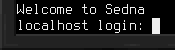

# Getting Started
This article describes the steps required to get a [computer](block/computer.md) up and running, and gives an example of how it can be used to interact with devices.

## Building
First things first, you need an actual computer, plus a couple of components. If you haven't already, craft these first:
- 1x [computer](block/computer.md)
- 1x **Linux** [hard drive](item/hard_drive.md) (regular 8M hard drive, then craft it with a [wrench](item/wrench.md))
- 3x 8M [Memory](item/memory.md)

Once you got all this, place down the computer. Open its inventory screen using a wrench. Alternatively, open the terminal screen, then use the toggle button to the left to switch to the inventory screen. Here, place the crafted hard drive and memory into the computer.

## Starting
To power up your freshly build computer, you'll usually need to supply it with some power. Have a look at the energy bar to the left of the terminal or inventory screen. Its tooltip informs you of the current amount of energy stored in the computer, and the amount of energy it requires per tick to keep running.

When you've ensured the required amount of energy is available, switch to the terminal screen and hit the power button to the top left. Alternatively use the computer while sneaking. The computer should now boot! Wait until you're prompted for a login.

Enter `root` as the user name to log in with and press enter. Well done, you now have a computer that's ready for use!

You can now add more devices, depending on what you want to use your computer for. For information on how to control devices, have a look at the [scripting](scripting.md) manual entry.

Good luck, and most importantly, have fun!