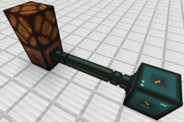
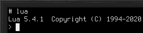
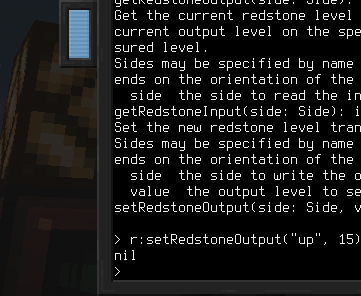

# Scripting
Controlling devices using Lua is a core concept when using [computers](block/computer.md). Many devices are so-called high level API (HLAPI) devices. This means they are not controlled using regular Linux drives, but via a simple RPC system, employing JSON messages over a serial device.

## The Devices Library
The default Linux distribution includes libraries to make HLAPI devices more easily accessible. The `devices` library provides utilities for discovering devices and calling methods on them, as well as obtaining documentation on devices, when available.

To use the `devices` library, import it using `require("devices")`.

### Methods
`list():table` returns a list of all currently available devices. Each entry in the returned table represents a single device, including its type names and unique identifier.
- Returns the list of connected HLAPI devices.

`get(id:string):Device` returns a wrapper for a device with the specified identifier. This is similar to `find` but takes a specific identifier instead of a type name.
- `id` is the unique identifier of the device.
- Returns a wrapper for the specified device.

`find(typeName):Device` returns a wrapper for a device of the specified type. If there are many devices of this type, it is undefined which one will be returned. Aliases set in [Bus Interfaces](block/bus_interface.md) may also be used.
- `typeName` is the device type for which to find a device.
- Returns a wrapper for a device of the specified device.

`methods(id:string):table` returns the list of methods offered by the device with the specified identifier. To obtain the list of methods in a more readable way, get the device wrapper and convert it to a string, instead. Also see the section on the device wrapper type.
- `id` is the unique identifier of the device.
- Returns the list of methods offered by the device.
- Throws an error if obtaining the method list failed.

`invoke(id:string, methodName:string, ...):any` calls the method with the specified name on the device with the specified identifier. Passes along any extra parameters. Using this method directly is not recommended. Prefer obtaining a device wrapper and invoking the method through it. Also see the section on the device wrapper type.
- `id` is the unique identifier of the device.
- `methodName` is the name of the method to invoke.
- `...` are parameters to pass to the method.
- Returns the result of the method.
- Throws an error if invocation failed, or the method threw an exception.

## The Device Wrapper
Devices returned from the `device` library are objects of type `Device`. This is a wrapper storing the device identifier.

Its main purpose is to enable seamless invocation of methods exposed by this device, as well as a convenient way to access documentation, if available.

To invoke a method on such a wrapper, use colon notation, and the method's name. For example:  
`wrapper:someMethod(1, 2, 3)`

To obtain the documentation of the device, `tostring` it. In the Lua interpreter, use `=wrapper`.

## Example
For this example we will control a [redstone interface block](block/redstone_interface.md). First, place the block and connect it to the computer using [bus cables](block/bus_cable.md) and [bus interfaces](block/bus_interface.md).

We place a redstone lamp on top of the redstone interface to have a visual indicator that our commands work.

To verify the connection between device and computer, run the command `lsdev.lua` from the command line. This lists the identifiers and type names of all connected HLAPI devices. One of these should have the type `redstone` among its type names.

Start Lua in interactive mode by running just `lua` from the command line.

Include the devices library and store it in a variable named `d`:  
`d = require("devices")`

Then get the `Device` wrapper for the redstone interface block and store it in a variable named `r`:  
`r = d:find("redstone")`

The `redstone` in this call is the device type name, the same we checked for just earlier using `lsdev.lua`.

We now have a wrapper for the redstone interface block on which we may call methods. To get a list of the available methods, run `=r`.

For our example, we're interested in the `setRedstoneOutput` method. It allows setting the signal emitted from the redstone interface.

To light up our lamp, we want to emit a redstone signal from the top face of the redstone interface block:  
`r:setRedstoneOutput("up", 15)`

The lamp should now light up!

With this, you have the tools to learn the names of connected devices, which methods they offer and how to obtain their documentation. Go ahead and experiment with the other methods of the redstone interface to read incoming redstone signals, or try out other devices!
