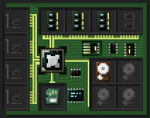
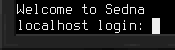

## Primeiros Passos
Este artigo descreve os passos requeridos para obter um [computador](block/computer.md) pronto a utilizar, e dá um exemplo de como eles podem ser utilizados para interagir com dispositivos.

## Construção
Começando pelo início, você precisa de um computador, e mais uns componentes. 
Se ainda não os possuí, obtenha estes componentes:
- 1x [computador](block/computer.md)
- 1x [disco rígido](item/hard_drive.md) **Linux** (disco rígido 8M normal, seguido de o combinar com uma [wrench](item/wrench.md))
- 3x [Memória](item/memory.md) 8M

Após obter todos os componentes, coloque o computador. Abra o ecrã de inventário do mesmo utilizando uma wrench. Alternativamente, abra o ecrã de terminal e alterne o botão de alternar para a esquerda e mude para o ecrã de inventário. Aqui, coloque o disco rígido e memória obtidos no computador.

## Iniciando
Para iniciar o seu computador acabado de construir, você vai precisar de lhe fornecer energia. Veja a barra de energia á esquerda do terminal ou do inventário. As suas dicas de ferramenta informa-no do nível de energia armazenada no seu computador atualmente, e a quantidade de energia requerida por tick para a contínua execução.

Assim que você assegurar a quantidade de energia necessária, mude para o ecrã de terminal e clique no botão de iniciar no canto superior esquerdo. Alternativamente, use o computador enquanto agachado. O computador deverá iniciar! Espere até que sejam pedidas as credenciais de login.

Coloque `root` como o nome de utilizador e pressione enter. Parabéns, você agora tem um computador pronto a utilizar.

Você pode adicionar mais dispositivos, dependendo naquilo que você quer utilizar aquele computador. Para mais informação sobre como controlar dispositivos, veja a entrada [scripting](scripting.md) do manual.

Boa sorte, e mais importante, divirta-se.
