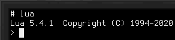

# Scripting
Controlar vários dispositivos utilizando Lua é um conceito-chave ao utilizar [computadores](block/computer.md). Muitos dispositivos são chamados de dispositivos de API de alto nível (APIAN). Isto significa que eles não são controlados por drivers Linux normais, mas por um sistema RPC simples, utilizando mensagens JSON através de um dispositivo serial.

## A Biblioteca Devices
A distribuição Linux predefinida inclui bibliotecas para facilitar o uso de dispositivos APIAN. A biblioteca `devices` fornece utilidades para descobrir dispositivos e invocar métodos nos mesmos, e também obter documentação acerca dos dispositivos, quando disponível.

Para utilizar a biblioteca `devices`, importe-a utilizando `require("devices")`.

### Métodos
`list():table` retorna uma tabela possuindo todos os dispositivos atualmente disponíveis. Cada entrada na tabela retornada representa um único dispositivo, incluindo os seus nomes de tipo e identificador único.
- Retorna a lista de dispositivos APIAN conectados.

`get(id:string):Device` retorna um wrapper para um dispositivo com o identificador especificado. Isto é similar ao `find` mas aceita um identificador específico em vez de um nome de tipo,
- `id` é o identificador único do dispositivo.
- Retorna um wrapper para o dispositivo especificado.

`find(typeName):Device` retorna um wrapper para um dispositivo com o tipo especificado. Se existirem múltiplos dispositivos com este tipo, é indefinido qual será retornado. Aliases definidos em [Interfaces BUS](block/bus_interface.md) também podem ser utilizadas.
- `typeName` é o tipo do dispositivo a ser utilizado.
- Retorna um wrapper para o dispositivo especificado.

`methods(id:string):table` retorna a tabela de métodos oferecidos pelo dispositivo com o identificador especificado. Para obter uma lista de métodos numa versão de leitura simplificada, obtenha o wrapper para o dispositivo e converta-o para uma string. Veja também a secção acerca do tipo de wrapper de dispositivo.
- `id` é o identificador único do dispositivo.
- Retorna uma lista de métodos oferecidos pelo dispositivo.
- Lança um erro se a obtenção da lista falhou.

`invoke(id:string, methodName:string, ...):any` invoca o método com o nome especificado no dispositivo com o identificador especificado. Passa ao método quaisquer parâmetros extra. O uso deste método diretamente não é recomendado. Prefira a obtenção de um wrapper para o dispositivo e invocar o método através dele. Veja também a secção acerca do tipo de wrapper de dispositivo.
- `id` é o identificador único do dispositivo.
- `methodName` é o nome do método a invocar.
- `...` são os parâmetros a passar ao método.
- Lança um erro se a invocação falhou ou se o método lançou uma exceção.

## O Wrapper de Dispositivo
Neste exemplo iremos controlar um [bloco de interface de redstone](block/redstone_interface.md). Primeiramente, coloque o bloco e conecte-o ao computador utilizando [cabos BUS](block/bus_cable.md) e [interfaces BUS](block/bus_interface.md).

Colocamos uma lâmpada de redstone em cima da interface de redstone como um indicador visual de que os nossos comandos funcionam.

Para verificar a conecção entre o dispositivo e o computador, execute o comando `lsdev.lua` a partir da linha de comandos. Este comando lista os identificadores e nomes de tipo de todos os dispositivos APIAN conectados. Um deles deverá possuir o tipo `redstone`.

Inicie Lua no modo interativo ao executar `lua` a partir da linha de comandos.

Inclua a biblioteca devices e armazene-a numa variável chamada `d`:
`d = require("devices")`

Após isso, obtenha o wrapper de dispositivo para o bloco de interface de redstone e armazene-o numa variável chamada `r`:
`r = d:find("redstone")`

Nesta invocação, `redstone` é o nome de tipo do dispositivo, que verificámos antes utilizando o comando `lsdev.lua`.

Agora possuímos um wrapper para o bloco de interface de redstone, no qual podemos invocar métodos. Para obter uma lista de métodos, execute `=r`.

Neste exemplo, interessa-nos o método `setRedstoneOutput`. Ele permite-nos definir o sinal emitido pela interface de redstone.

Para ligarmos a nossa lâmpada, precisamos de emitir um sinal de redstone a partir da face superior do bloco de interface de redstone:
`r:setRedstoneOutput("up", 15)`

A lâmpada deverá então estar ligada!

Com isto, você tem as ferramentas para obter os nomes dos dispositivos conectados, que métodos eles oferecem e como obter a documentação dos mesmos. Sinta-se livre para experimentar com outros métodos da interface de redstone para ler sinais externos, ou experimente com outros dispositivos!
