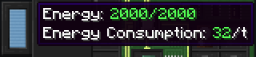

# Руководство для начинающих
Данный раздел описывает шаги, необходимые для настройки и запуска [компьютера](block/computer.md), а также показывает, как взаимодействовать с устройствами.

## Сборка
Прежде всего вам нужен сам компьютер и кучка компонентов. Если у вас их нет, то создайте:
- 1x [компьютер](block/computer.md)
- 1x **Linux** [жесткий диск](item/hard_drive.md) (создайте обычный 8Мб жесткий диск и положите его на крафт вместе с [ключом](item/wrench.md))
- 3x 8M [Память](item/memory.md)

После того, как вы создали все нужное, поставьте компьютер. Откройте его инвентарь, кликнув по компьютеру ключом. Или откройте терминал, а затем слева нажмите на кнопку инвентаря. Здесь поместите созданные вами жесткий диск и память.

## Запуск
Чтобы запустить ваш только что собранный компьютер, вам нужен источник питания. Обратите внимание на полоску энергии слева от терминала или инвентаря компьютера. Она информирует вас о количестве запасенной в компьютере энергии, и количестве энергии, потребляемой за один тик работы.

Когда вы добыли необходимое количество энергии, переключитесь на терминал и нажмите на кнопку питания вверху слева. Или нажмите на компьютер, присев. Теперь он начнет загружаться! Дождитесь приглашения ввода логина.

Наберите в поле логина `root` и нажмите клавишу ввода. Вот и все, теперь ваш компьютер готов к работе!

Теперь вы можете добавить дополнительные устройства, в зависимости от того, что вам нужно. За информацией по управлению устройствами обращайтесь в раздел [скрипты](scripting.md).

Удачи, и что самое главное, веселья!