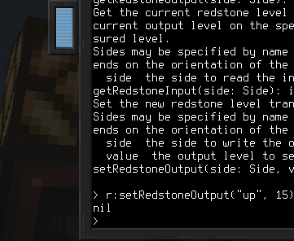

# Скрипты
Контроль устройств с помощью Lua - это основная механика при использовании [компьютеров](block/computer.md). Большинство устройств здесь имеют высокоуровневое API (HLAPI). Это означает, что они не контролируются системой Linux, используя вместо этого простую RPC систему, передающую JSON сообщения через последовательное устройство.

## Библиотека устройств
В дистрибутив Linux входит библиотека для упрощения доступа к HLAPI устройствам. Библиотека `devices` предоставляет набор функций для обнаружения устройств и вызова их методов, а также получения их документации, если она имеется.

Для использования библиотеки `devices` , импортируйте ее с помощью строки `require("devices")`.

### Методы
`list():table` возвращает список со всеми доступными устройствами. Каждая запись в этой таблице представляет собой другую таблицу с названиями устройства и его уникальным номером.
- Возвращает список с подключенными HLAPI устройствами.

`get(id:string):Device` возвращает обертку над устройством по его идентификатору. Работает аналогично функции `find`, но вместо имени использует идентификатор.
- `id` - уникальный идентификатор устройства.
- Возвращает обертку над указанным устройством.

`find(typeName):Device` возвращает обертку над устройством по его типу (имени). Если устройств с таким названием несколько, будет передан случайный. В качестве типа можно указать название подключенной к нему [интерфейсной шины](block/bus_interface.md).
- `typeName` - тип устройства для поиска.
- Возвращает обертку над указанным устройством.

`methods(id:string):table` возвращает список методов устройства по его идентификатору. Для получения более читабельного списка рекомендуется получить обертку устройства и преобразовать ее в строку. Также посмотрите раздел о типе обертки устройства.
- `id` - уникальный идентификатор устройства.
- Возвращает список методов устройства.
- Создает ошибку, если не удалось получить список.

`invoke(id:string, methodName:string, ...):any` вызывает метод по его названию и идентификатору устройства. Принимает разное количество параметров (зависит от метода). Не рекомендуется напрямую использовать данный метод. Получите обертку над устройством и вызывайте методы через нее. Также посмотрите раздел о типе обертки устройства.
- `id` - уникальный идентификатор устройства.
- `methodName` - название метода для вызова.
- `...` - параметры для вызываемого метода.
- Возвращает результат метода.
- Создает ошибку, если вызов не удался или вызываемый метод сам создал ошибку.

## Обертка устройства
Устройства, возвращаемые библиотекой `device` являются объектами типа `Device`. Это обертка, содержащая в себе идентификатор устройства.

Ее основная цель - упростить вызов методов устройств и получение документации, если она есть.

Для вызова метода через обертку используйте двоеточие и имя метода. Например:  
`wrapper:someMethod(1, 2, 3)`

Для получения документации по устройству примените на обертке `tostring`. В интерпретаторе Lua используйте строчку `=wrapper` (где вместо `wrapper` вводится имя переменной с оберткой).

## Пример
В этом примере мы научимся управлять [блоком красного интерфейса](block/redstone_interface.md). Для начала поставьте блок и подключите его к компьютеру через [интерфейсный кабель](block/bus_cable.md) и [интерфейсные шины](block/bus_interface.md).

Мы поставим лампу на блок (сверху) для визуальной индикации наличия красного сигнала.

Дабы убедиться, что блок подключен, запустим команду `lsdev.lua` . Она выводит список со всеми подключенными HLAPI устройствами. Одно из них должно называться `redstone`.

Запустите интерпретатор Lua командой `lua`.

Подключите библиотеку устройств и запишите ее в переменную `d`:  
`d = require("devices")`

Затем получите обертку `Device` для блока красного интерфейса и запишите ее в переменную `r`:  
`r = d:find("redstone")`

Здесь строка `redstone` обозначает название (тип) устройства. Тот самый, что был указан в `lsdev.lua`.

Теперь у нас есть обертка для блока, из которой мы можем вызывать методы. Для получения списка всех доступных методов ведите строку `=r`.

В данный момент нам нужен метод `setRedstoneOutput`. Он позволяет устанавливать уровень сигнала, излучаемого сторонами красного интерфейса.

Чтобы зажечь лампу, нам нужно подать красный сигнал на верх блока:  
`r:setRedstoneOutput("up", 15)`

Теперь лампа должна зажечься!

С помощью этого примера вы теперь можете сами узнавать названия компонентов, их методы и документацию к ним. Идите вперед и экспериментируйте с другими методами красного интерфейса для, например, считывания входящего красного сигнала или попробуйте другие устройства!
